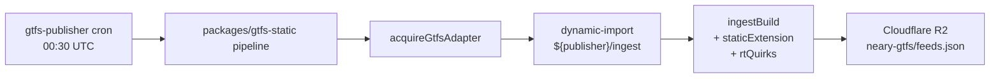

# gtfs-adapters

Per-feed GTFS adapters for the [n3ary](https://github.com/n3ary) family. Each
adapter holds **all per-feed knowledge** for one city/feed — CSV format
quirks, source reconciliation, color resolution, RT recovery.

The generic [n3ary/gtfs](https://github.com/n3ary/gtfs) repo stays
**feed-agnostic** — its packages (`@n3ary/gtfs-spec`, the generic
GTFS→SQLite converter, the generic RT proxy) have no per-feed knowledge.

## Layout

```text
gtfs-adapters/
├── pnpm-workspace.yaml          # trustPolicy: off, no-fallback; trust the lockfile
├── docs/
│   └── standards/               # 10 governance rules vendored from n3ary/standards
└── adapters/
    └── cluj-napoca/            # @n3ary/gtfs-adapter-cluj-napoca
        ├── src/
        │   ├── ingest/         # runtime entry: ingestBuild(opts) → { zip, sizeBytes }
        │   ├── static/         # sqlite extension (route colors, _neary_config)
        │   ├── rt/             # GTFS-RT quirk for the CTP live feed
        │   ├── assemble/       # merge / derive / emit / check (3-source reconcile)
        │   ├── sources/        # Tranzy + Transitous + CTP CSV fetchers
        │   ├── lib/            # pure helpers (seed, timing, polyline, log-severity)
        │   ├── gtfs.ts         # .gtfs.zip writer (uses @n3ary/gtfs-spec/serialize)
        │   └── verify-trip-id-format.ts  # CLI: trip_id _HHMM suffix regression check
        ├── tests/              # 164 tests, vitest, canned fixtures
        ├── docs/               # architecture, assemble-rules, known-limitations, ...
        └── package.json
```

## How an adapter runs

Each adapter is a library. The runtime entry is a `gtfs-publisher` orchestrator
that dynamic-imports `${publisher}/ingest`:



Per-adapter subpaths:

- **`${publisher}/ingest`** — `ingestBuild(opts)` returns `{ zip, sizeBytes }`. Required.
- **`${publisher}/static`** — `staticExtension(feedConfig)` for sqlite
  columns. Required by `make-sqlite.ts`.
- **`${publisher}/rt`** — RT proxy quirks via `registerRtQuirks`. Loaded by
  the orchestrator's quirk registry.

## Adding a new adapter

```bash
mkdir -p adapters/<city>
# mirror cluj-napoca/, write the three subpaths:
#   src/ingest/index.ts        — ingestBuild(opts)
#   src/static/index.ts        — staticExtension(feedConfig)
#   src/rt/index.ts            — registerRtQuirks(register)
# See https://github.com/n3ary/gtfs-adapters/blob/main/adapters/cluj-napoca/docs/architecture.md
# for the per-adapter architecture write-up.
```

The orchestrator picks it up via a `feedConfig` entry in
[`n3ary/gtfs/feeds/<city>/config.json`](https://github.com/n3ary/gtfs/tree/main/feeds).

## Cross-references

- [n3ary/gtfs](https://github.com/n3ary/gtfs) — generic converter + spec.
- [n3ary/gtfs-publisher](https://github.com/n3ary/gtfs-publisher) — daily cron
  orchestrator that dynamic-imports adapters from this repo.
- [n3ary/app](https://github.com/n3ary/app) — consumer PWA.
- [n3ary/branding](https://github.com/n3ary/branding) — brand assets.
- [n3ary/standards](https://github.com/n3ary/standards) — vendored into
  `docs/standards/`; drift-checked by `check-standards-drift.yml`.

## License

[PolyForm Noncommercial License 1.0.0](./LICENSE) for the strict-tier repos
(`gtfs-adapters`, `app`, `gtfs`). See `n3ary/standards` for the full org
licensing model.
