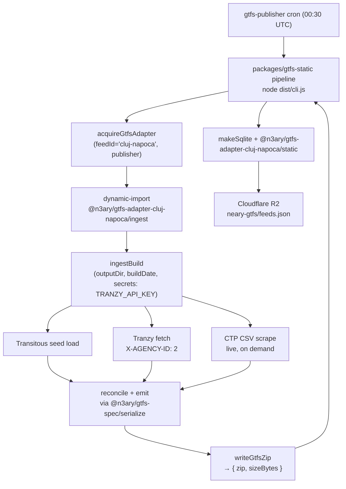

# cluj-napoca-gtfs-adapter

Reconciled GTFS Schedule publisher for Cluj-Napoca (CTP) — combines three
independent data sources into one feed. Runtime entry point is `ingestBuild()`,
called by [`n3ary/gtfs-publisher`](https://github.com/n3ary/gtfs-publisher)
which publishes the resulting zip + sqlite to Cloudflare R2 for the
[neary](https://github.com/ciotlosm/neary) PWA.

## What it does

Pulls data from three independent sources and reconciles them:

| Source | Strong on | Used for |
|---|---|---|
| **Transitous** (`api.transitous.org`) | Curated, mdb-validated structure | Primary route/stop/shape definitions |
| **Tranzy.ai** (`api.tranzy.ai`) | Live-updated static data, per-direction shapes | Fills gaps when Transitous is missing directions (`neary-gtfs#13`, `#15`) |
| **CTP CSV timetables** (`ctpcj.ro/orare/csv/`) | Authoritative departure times | Per-route, per-service-day schedules |

Output zip: `cluj-napoca.gtfs.zip`. See [`docs/architecture.md`](./docs/architecture.md)
for the data flow and [`docs/assemble-rules.md`](./docs/assemble-rules.md) for
the source priority table.

## Deployment

The adapter is a library — it has no CLI, no schedule, and no direct
network access from its own cron. The orchestrator drives the build:



The canonical publish lives in `n3ary/gtfs-publisher`. Consumers reach this
adapter's output exclusively through R2 — see its `daily.yml` for the cron.

## Project layout

```text
adapters/cluj-napoca/
├── src/
│   ├── ingest/index.ts          # runtime entry point — ingestBuild(opts)
│   ├── static/                  # sqlite extension (route colors, _neary_config)
│   ├── rt/                      # GTFS-RT quirk for the CTP live feed
│   ├── assemble/                # merge / derive / emit / check
│   │   ├── merge/               #   routes, stops, shapes
│   │   ├── derive/              #   patterns, calendar, frequencies
│   │   ├── emit/                #   trips, networks, tranzy-fallback
│   │   └── check/data-quality.ts
│   ├── sources/
│   │   ├── transitous/          #   seed zip loader + transform
│   │   ├── tranzy/              #   REST client + transform
│   │   └── ctp-csv/             #   live scrape + parser
│   ├── lib/                     # pure helpers (seed.ts, timing.ts, polyline.ts, log-severity.ts)
│   ├── gtfs.ts                  # output writer (.gtfs.zip)
│   └── verify-trip-id-format.ts # CLI: trip-id _HHMM suffix regression check
├── tests/                       # 164 tests, vitest, canned fixtures
├── docs/                        # architecture, assemble-rules, known-limitations
└── package.json                 # @n3ary/gtfs-adapter-cluj-napoca
```

## Local development

```bash
pnpm install                # uses pnpm-workspace.yaml trustPolicy: no-fallback
pnpm build                  # tsc -p tsconfig.build.json → dist/
pnpm test                   # 164 tests, vitest
pnpm check                  # tsc --noEmit + tsc.test --noEmit
pnpm smoke:trip-ids         # self-check every emitted trip_id ends in _HHMM
```

`pnpm smoke:trip-ids` runs `src/verify-trip-id-format.ts`. The adapter has no
network credentials of its own — secrets are passed in by the orchestrator via
`ingestBuild({ secrets: { TRANZY_API_KEY } })`.

## Known limitations

See [`docs/known-limitations.md`](./docs/known-limitations.md). Headline items:
- Calendar is synthesized from the CSV service keys we actually scraped; not
  aligned with CTP's published service calendar.
- Trip IDs are not contract-bound to `cluj-rt-feed.gtfs.ro` GTFS-RT — `neary`'s
  reconcile keys on `(routeId, directionId, tripStartMin)`. The trip-id
  `_HHMM` suffix regression check is internal-only.
- Routes with neither a CSV nor a Tranzy/Transitous pattern emit zero trips.

## Documentation conventions

All `*.md` files follow
[GitHub's alerts standard](https://docs.github.com/en/get-started/writing-on-github/getting-started-with-writing-and-formatting-on-github/basic-writing-and-formatting-syntax#alerts)
for callouts — **not** plain blockquotes. Use the right type for the
semantics:

| Alert | When to use |
|---|---|
| `> [!NOTE]` | Informational context — source attributions, background facts, doc purpose. |
| `> [!IMPORTANT]` | Crucial information the reader must not skip — invariants, contract details. |
| `> [!WARNING]` | Critical content demanding immediate attention — risky behavior, data loss scenarios. |
| `> [!TIP]` | Useful advice, alternative approaches, helpful quotes from other code/docs. |
| `> [!CAUTION]` | Negative potential consequences of an action — "if you do X, Y will break". |

A multi-line alert looks like this:

```markdown
> [!IMPORTANT]
> **This is a contract.** Don't change this without coordinating
> with the realtime bridge repo.
```

Plain `>` blockquotes are reserved for actual quoted material (e.g.
a verbatim citation from another project's code or docs).

## Diagrams

Use [Mermaid](https://mermaid.js.org/) — not ASCII art. ASCII boxes drift
on rendering and break search/diff.

## Contributing

`main` is protected — every change goes through a PR. See
[`docs/standards/version-management.md`](docs/standards/version-management.md)
for the bump-on-PR rule. PRs trigger
[`.github/workflows/pr-validation.yml`](.github/workflows/pr-validation.yml)
which runs `check` + `test`. Merging to `main` triggers
[`.github/workflows/publish-adapter.yml`](.github/workflows/publish-adapter.yml)
on `adapters/cluj-napoca/v*` tags.

Branch protection on `main`:
- PR required, 0 approvals (solo-dev friendly)
- Linear history (squash/rebase only)
- No force-push, no branch deletion
- **Require branches to be up to date** (so the version sequencing can't race)

## License

[PolyForm Noncommercial License 1.0.0](./LICENSE) — free for individuals,
hobbyists, education, research, and charitable organizations. Any commercial
use (paid products, paid services, or hosted services for revenue) needs a
separate license from the author. Schedule data © CTP Cluj-Napoca; this
software is a personal transit data tool, not affiliated with CTP.
