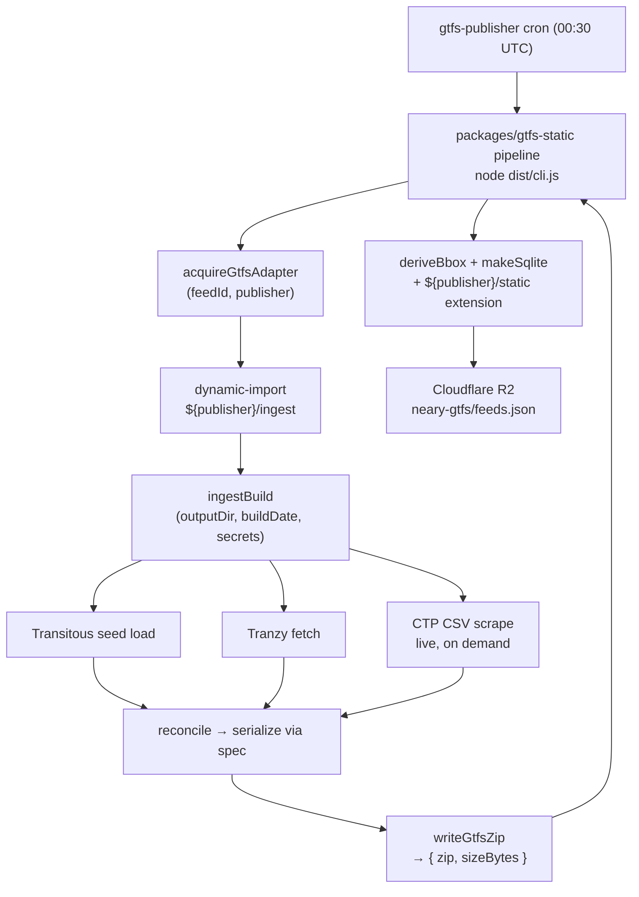
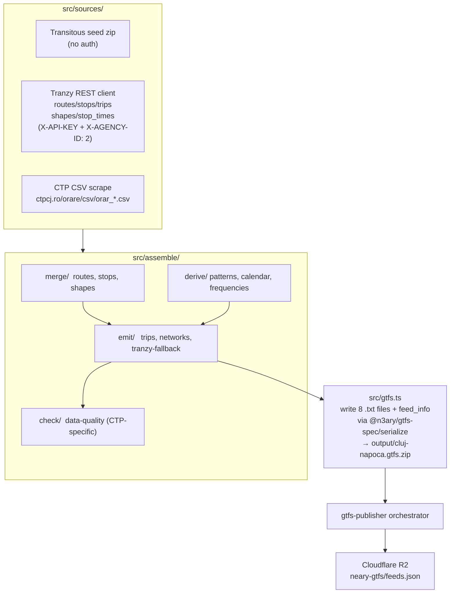

# Architecture

## Goal

Produce a single reconciled GTFS Schedule zip for CTP Cluj-Napoca
(`agency_id=2`) that combines:

- **Transitous seed** — curated structure, mdb-validated
- **Tranzy.ai** — live-updated static API, per-direction shapes
- **CTP CSV timetables** — authoritative departure times

…published by the orchestrator (`n3ary/gtfs-publisher`) to Cloudflare R2 so
the [neary](https://github.com/ciotlosm/neary) PWA can consume it like any
other GTFS source.

## Driver: `n3ary/gtfs-publisher` orchestrator

The adapter has no CLI and no schedule of its own. It exposes `ingestBuild()`
and three subpaths:

- `./ingest` — `ingestBuild` (the runtime entry; required)
- `./static` — `staticExtension(feedConfig)` for sqlite columns (route
  colors + `_neary_config` table); required by the orchestrator's
  `makeSqlite`
- `./rt` — `clujQuirk` for the GTFS-RT proxy in `gtfs-rt`; loaded by
  the orchestrator's quirk registry

See `src/ingest/index.ts:38-77` for the `IngestOptions` / `IngestResult`
contract and `src/static/index.ts` for the extension shape.

## Why three sources?

CTP doesn't expose its schedule data through one canonical GTFS feed:

- **Tranzy.ai** is the live network state — 168 routes, 880+ stops,
  per-direction shapes (`<route>_<dir>` convention), up-to-date
  colors/headsigns. CTP city hall officially promotes Tranzy as their
  open-data partner (see `https://ctpcj.ro/index.php/ro/despre-noi/
  open-data-tranzy`). Tranzy carries stop ordering but **not** arrival
  times (`/stop_times` has no `arrival_time`).
- **Transitous** mirror (`mdb-2121`) is the curated secondary catalog —
  108 routes, 750 stops, mdb-validated coordinates and IDs. Updates
  irregularly (sometimes weeks stale — see
  [`neary-gtfs#1`](https://github.com/ciotlosm/neary-gtfs/issues/1)).
  Used by this adapter mainly for **ID stability**: downstream apps
  (notably `neary`) already key routes by Transitous `route_id`, and
  re-keying shared routes to Tranzy's internal IDs would break every
  catalog reference.
- **CTP CSV timetables** carry the real departure times per route per
  service day. CTP doesn't publish them for every route (~63 of ~298
  missing — same `neary-gtfs#1`).

The three sources are complementary. Reconciliation is the only way to
get a feed that's *complete*, *fresh*, and *correct* — and *stable in
the IDs downstream apps already key on*.

## Data flow

## Components

### `src/sources/`

Each upstream source has its own folder with a 3-file structure:
`client.ts` (network IO), `transform.ts` (pure data shape conversion),
`index.ts` (public API + convenience loader).

- `src/sources/tranzy/` — Tranzy.ai REST client + GTFS-shaped transform.
  Public API: `loadTranzyData(opts)` → `{ routes, stops, trips, ...,
  byRouteId, byStopId }`. Single network layer (`TranzyClient`), pure
  transform layer (stamps `source: 'tranzy'` + builds indexes).
- `src/sources/transitous/` — Transitous GTFS zip loader + transform.
  Public API: `loadTransitousData(opts)` → `{ routes, stops, trips, ...,
  patternsByRouteDir }`.
- `src/sources/ctp-csv/` — CTP CSV timetable fetcher + parser. Public
  API: `fetchCtpCsv()` (network, live), `fetchAllCsvSchedules()`
  (multi-fetch orchestrator), `parseCtpCsv()` (pure parser),
  `buildCtpCsvUrl()` + `normalizeShortNameForCtpUrl()` (URL builder —
  the latter strips whitespace so `39 CREIC` becomes `39CREIC`).

### `src/assemble/`

Pipeline that produces the final in-memory GTFS structure, grouped by
the kind of work each file does:

- `merge/` — combine rows from multiple sources.
  - `routes.ts` — Tranzy primary + Transitous overlay (re-keys shared
    routes to Transitous `route_id` for downstream stability).
  - `stops.ts` — Tranzy primary + Transitous fill (Tranzy covers more
    stops; Transitous fills the legacy few hundred Tranzy doesn't).
  - `shapes.ts` — Tranzy primary + Transitous fill (per-direction
    shapes `<route>_<dir>` convention).
- `derive/` — build one structure from a single source.
  - `patterns.ts` — first trip's stop sequence per `(route_id, dir)`;
    Tranzy primary, Transitous seed fallback.
  - `calendar.ts` — service-id → weekday-bool map from CSV keys.
  - `frequencies.ts` — anchor trip emission for `*-range` annotations.
- `emit/` — generate GTFS rows.
  - `trips.ts` — for each CSV departure, pick the pattern, generate
    `trip_id` (format `${route}_${dir}_${serviceId}_${HHMM}`), write
    trip + stop_times rows. Validates CSV terminals against pattern
    first stops. Emits `timepoint='0'` on every stop_time row (times
    are interpolated, not authoritative).
  - `tranzy-fallback.ts` — NTxxx fallback trips for routes without CSV.
  - `networks.ts` — `networks.txt` + `route_networks.txt` from
    classified routes.
- `check/` — coverage warnings (CTP-specific).
  - `data-quality.ts` — emit warnings (#14 route colors, #15 M26
    frequencies, etc.).

`index.ts` at top of `assemble/` is the orchestrator for `reconcile()`.

**Source priority table** lives in
[`docs/assemble-rules.md`](./assemble-rules.md). Transitous is
consulted only for: ID stability on shared routes, fallback patterns
for Transitous-only routes (~1 today), lookup-only fallbacks when CTP
references a stop Tranzy doesn't have, and `agency.txt`.

### `src/lib/`

Pure helpers, no I/O.

- `seed.ts` — load Transitous GTFS zip from path/URL, parse with
  `@n3ary/gtfs-spec/spec` parsers.
- `timing.ts` — `pickSpeedBucket()` + `computeStopTimes()` (peak/offpeak/
  night speed model + shape projection + dwell).
- `polyline.ts` — `cumulativeShapeDistances()` (adapter-specific
  composition helper) + re-exports of `haversineMeters` and
  `projectOnPolyline` from `@n3ary/gtfs-spec/shape` (canonical shared
  math).
- `log-severity.ts` — tagged warning objects (`{severity, message, meta}`)
  with GHA `::group::` rendering and ANSI colors.

### `src/gtfs.ts`

The output writer. Given the assembled in-memory structures from
`src/assemble/`, writes the eight required GTFS `.txt` files plus
`feed_info.txt` into a zip using `archiver`. Column order and RFC 4180
quoting come from `@n3ary/gtfs-spec/serialize`.

### `src/ingest/index.ts`

The runtime entry point. Exports `ingestBuild(opts)` returning
`{ zip, sizeBytes }`. The orchestrator dynamic-imports this and calls it.

### `src/static/index.ts`

The sqlite extension factory. Exports `staticExtension(feedConfig)`
returning a `StaticExtension` (column/table extensions + a
`fillComputedColumns` hook).

Since the SQL-free refactor, this module is a PURE data-in / data-out
producer: it never imports a SQLite driver and never touches the
database. The `fillComputedColumns` hook receives the buffered spec
rows + a feedId and returns a `ComputedUpdates` object describing
per-table partial rows to UPDATE. The pipeline owns the SQL.

The orchestrator passes the StaticExtension to
`makeSqlite(gtfsPath, feedId, staticExtension)`, which calls the
hook after spec CSVs land and applies the returned updates via
`UPDATE ... WHERE <pk>` built from the spec's SCHEMA.

### `src/rt/index.ts`

The GTFS-RT quirk for the CTP live feed. Exports `clujQuirk`,
`parseClujTripId`, `registerRtQuirks`. Consumed by the `gtfs-rt`
proxy's quirk registry.

### `src/verify-trip-id-format.ts`

CLI: `tsx src/verify-trip-id-format.ts`. Reads an emitted zip and asserts
every `trips.txt` row's `trip_id` ends in `_HHMM` (or `_NTxxx` for
Tranzy-fallback trips). Lets `neary`'s `parseLiveStartMin` extract the
scheduled start time from the suffix.

## Build / publish

- `pnpm build` — `tsc -p tsconfig.build.json`. Emits to `dist/`.
- `pnpm test` — `vitest --run`. 164 tests.
- `pnpm check` — `tsc -p tsconfig.json --noEmit && tsc -p tsconfig.test.json --noEmit`.
- `pnpm smoke:trip-ids` — `tsx src/verify-trip-id-format.ts`.

Publishing: `adapters/cluj-napoca/v*` tags trigger
`.github/workflows/publish-adapter.yml` which runs
`npm publish --access restricted` against GitHub Packages. The
orchestrator pins an exact version in
`packages/gtfs-static/package.json` and bumps it in a PR after each
release.
